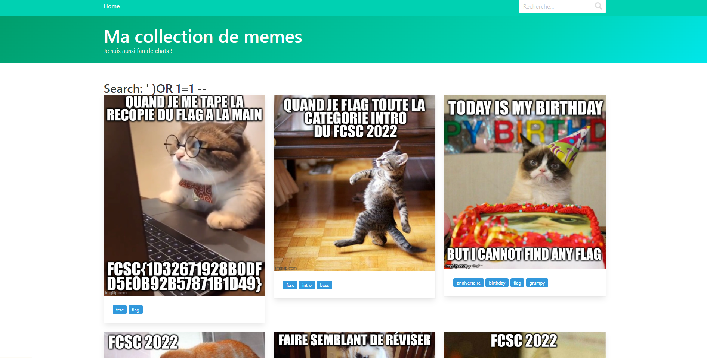
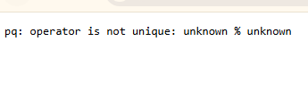

# charpistri2

# Write-up: FCSC 2022 - Web Challenge - Chatpristi 2

## Challenge Description
The challenge consisted of a simple web application featuring a collection of cat memes and a search bar. As soon as I accessed the website, I noticed the search bar, which immediately caught my attention as a possible entry point for injection attacks.

---

## Reconnaissance
I started by exploring the web page to understand its layout and possible vulnerabilities. The search bar seemed like a great candidate to test for SQL Injection vulnerabilities, as such fields often interact with the database.

---

## Testing Inputs

### First Test - Single Quote (')
To confirm any possible vulnerabilities, I began testing the search bar with random inputs.  
I entered a single quote (`'`) to test for SQL injection vulnerability. The result was an error message:

  pq: operator is not unique: unknown % unknown
  
This error indicated that the input was indeed being processed by the database and hinted at a possible injection vulnerability.

### Second test -Further Exploration: Encouraged by the error message, I crafted a basic SQL Injection payload:

  ' OR 1=1 --
However, this returned another error:

  pq: syntax error at end of input
At this point, it became clear that the database query might be missing a closing parenthesis ) before executing the payload.

## Crafting the Exploit
  Based on my observations, I modified the payload to include a closing parenthesis:

    ') OR 1=1 --
  
  When I executed this, the query bypassed the filter, and the page returned all the cat meme data, confirming the vulnerability!

## Retrieving the Flag
  Scrolling through the list of memes, I noticed that the first image contained the flag. The flag was clearly displayed in the image description:

## Copy code
  FCSC{edfaeb139255929e55a3cffe9f3f37cd4e871e5015c4d4ade2b02d77d44019e5}
